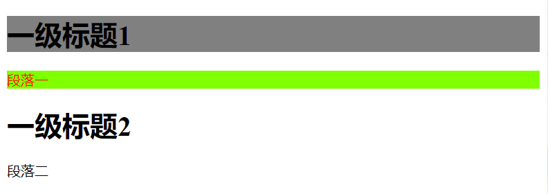

# 一、CSS简介

##1.1、什么是CSS

CSS：**Cascading Style Sheet**（层叠样式表），网页的表现，用来美化网页
主要包括：字体，颜色，边距，高度，宽度，背景图片，网页定位，网页浮动等

## 1.2、CSS发展史

CSS1.0
CSS2.0：DIV（块）+CSS，HTML与CSS结构分离的思想，网页变得简单，SEO
CSS2.1：浮动，定位
CSS3.0：圆角、阴影、动画…浏览器兼容性

## 1.3、CSS导入方式

### 1) 方式一：在标签后增加 style 属性

```html
<!DOCTYPE html>
<html lang="en">
<head>
    <meta charset="UTF-8">
    <title>Title</title>
</head>
<body>
    <h1 style="color: blue">一级标题</h1>
</body>
</html>
```


### 2) 方式二：在 html 文件里增加 style 标签

```html
<!DOCTYPE html>
<html lang="en">
<head>
    <meta charset="UTF-8">
    <title>Title</title>
    <!--语法：
            选择器{
                   声明1;
                   声明2;
                   声明3;}-->
    <style>
        h1{
            color: black;
        }
    </style>
</head>
<body>
    <h1>一级标题</h1>
</body>
</html>
```


### 3) 方式三：添加 link 标签，CSS 与 HTML 分离

```html
<!DOCTYPE html>
<html lang="en">
<head>
    <meta charset="UTF-8">
    <title>Title</title>
    <!--link标签：
                rel：声明类型
                href：链接地址-->
    <link rel="stylesheet" href="CSS/CSS01.css">
</head>
<body>
    <h1>一级标题</h1>
</body>
</html>
```

```css
h1{
    color: red;
}
```


### 4) 三种方式优先级比较

> 优先级采用就近原则，即离选择器近的，优先级高，因此，方式一优先级最高。
>
> 对于方式二、三优先级，不同位置效果不一样。如下示例：


# 二、选择器

> 选择器作用：选择页面上某一个或某一些元素

## 2.1、基本选择器

### ①、标签选择器

> 功能：选择一类标签
>
> 格式：
>
> ​	label{}

```html
<!DOCTYPE html>
<html lang="en">
<head>
    <meta charset="UTF-8">
    <title>Title</title>
    <style>
        h1{
            color: blue;
        }
    </style>
</head>
<body>
    <h1>一级标题</h1>
</body>
</html>
```


### ②、类选择器

> 功能：选择所以class一致的标签，可以跨标签
>
> 格式：
>
> ​	.class_name{}

```css
.demo1{
	color: blue;
       }
.demo2{
	color: red;
}
```


### ③、id 选择器

>功能：选择特定 id ，id 号全局唯一，不可重复
>
>格式：
>
>​	.id_num{}

**理论上来说，只要给定 id 号，id 选择器可以选择任意标签**

```css
/*id选择器*/
#id_1{
	background: gray;
	color: black;
}
#id_2{
	background: chartreuse;
	color: red;
}
```




## 2.2、属性选择器

> 属性选择器可以使用 id 和 class 属性
>
> 格式：
>
> ​	label[属性]{}

```html
<body>
    <p class="demo">
        <a href="http://www.baidu.com" class="links item first" id="first">1</a>
        <a href="/adad/faf" class="links item2 first2" >2</a>
        <a href="qwe123" class="links item3 first3" >3</a>
        <a href="eweqe" class="links item4 first4" >4</a>
        <a href="rrrrr" class="links item5 first5" >5</a>
        <a href="ttt" class="links item6 first6" >6</a>
        <a href="yyy" class="links item7 first7" >7</a>
    </p>
</body>
```

```css
.demo a{
            display: block;
            height: 50px;
            width: 50px;
            float:left;
            border-radius: 10px;
            background: blue;
            text-align: center;
            color: beige;
            text-decoration: none;
            margin-right: 5px;
            font: bold 20px/50px Arial;
}
/*属性名，属性名=属性值（正则）
         =表示绝对等于
         *=表示包含
         ^=表示以...开头
         $=表示以...结尾
         存在id属性的元素  a[]{}
*/
a[class="links item2 first2"]{
    color: red;
}
a[class*= "item4"]{
    color: yellow;
}
```


## 2.3、层次选择器

### ①、后代选择器

> 在某个元素后面，选择其所有后代元素

```html
<body>
    <p>段落一</p>
    <p>段落二</p>
    <p>段落三</p>
    <p>段落四
        <p>4.1</p>
        <p>4.2</p>
        <p>4.3
            <h1>4.3.1</h1>
            <h1>4.3.2</h1>
        </p>
    </p>
    <p>段落五</p>
    <p>段落六</p>
</body>
```

```css
<style>
	body p{
    color: red;
    background: yellow;
	}
</style>
```


### ②、子选择器

> 选择“儿子”代，后续代不选择
>
> 格式：
>
> ​	label1>label2{}

```css
body>p{
        color: red;
        background: yellow;
        }
```


### ③、相邻兄弟选择器

> 相邻兄弟选择器：只有一个，相邻（向下）

```html
<body>
    <p class="active">段落一</p>
    <p>段落二</p>
    <p>段落三</p>
    <p>段落四
        <p>4.1</p>
        <p>4.2</p>
        <p>4.3
            <h1>4.3.1</h1>
            <h1>4.3.2</h1>
        </p>
    </p>
    <p>段落五</p>
    <p>段落六</p>
</body>
```

```css
<style>
    .active+p{
        color: red;
        background: yellow;
    }
</style>
```


### ④、通用选择器

> 通用兄弟选择器：当前选中元素的向下的所有兄弟元素

```css
<style>
    .active~p{
    	color: red;
    	background: yellow;
    }
</style>
```


## 2.4、结构伪类选择器

```html
<body>
    <ul>编程语言
        <li>Python</li>
        <li>Java</li>
        <li>Go</li>
        <li>C++</li>
    </ul>
</body>
```

```CSS
<style>

    ul li:first-child{
        /*第一个子孩子*/
        background: gray;
        color: red;
    }
    ul li:last-child{
        background: yellow;
        color: green;
    }
</style>
```


# 三、美化网页元素

## 3.1、为什么要美化网页

- 有效传递页面信息
- 美化页面，吸引用户
- 凸显页面主题
- 提高用户体验

> 两个常用标签：`<span></span>` 和`<div></div>`，两个标签无其他作用，但可以用来分块、分级，使 html 代码更有层次性。

```html
<!DOCTYPE html>
<html lang="en">
<head>
    <meta charset="UTF-8">
    <title>Title</title>
</head>
<body>
    <div>
        学习<span>Java</span>
    </div>
</body>
</html>
```


## 3.2、字体样式

```css
字体样式美化：
    方法一：逐一设置
        font-family: 设置字型
        font-size: 设置字体大小
        font-weight: 设置字体粗细
    方法二：使用 font 关键字统一设置
        font：楷体 20px bolder
```

```css
<style>
    div{
        font-family: 楷体;
        font-size: 20px;
        font-weight: bolder;
}
```


## 3.3、文本样式

```css
color：颜色
text-align：文本对齐方式，center，left，right
text-indent：首行缩进，2em 代表缩进 2 个字符
line-height：行高，单位：300px；
img,span{vetical-align:middle}：图片、文字垂直对齐
text-decoration:underline		/*下划线*/
text-decoration:line-through	/*中划线*/
text-decoration:overline		/*上划线*/
text-decoration:none			/*超链接去下划线*/
```

```html
<!DOCTYPE html>
<html lang="en">
<head>
    <meta charset="UTF-8">
    <title>Title</title>
    <style>
        .Tittle{
            color: blue;
            text-align: center;
            line-height: 30px;
            font-size: 20px;
        }
        .infor{
            text-align: right;
            font-size: 10px;
            color: gray;
            text-decoration: underline;
        }
        .parg{
            font-family: 楷体;
            font-size: 15px;
            text-indent: 2em;
            
        }
    </style>
</head>
<body>
    <div>
        <p class="Tittle">儿时夏日情趣</p>
        <p class="infor">作者: 胡兆喜2022年01月21日散文随笔</p>

        <p class="parg">记忆中，儿时的夏季，是从午后开始的。烈日炎炎的午后，为防止我溜去河塘游泳，祖母总是拿出一张狗皮褥子，让我睡卧在门前那棵老槐树的浓荫下，而她则一直坐在旁边看着我。
            可是，那些藏在绿荫里的乡蝉此起彼伏的呼唤，以及栖息在灌木枝丛上五颜六色的蜻蜓，常常挠得一颗童心酥酥的痒。怎奈，祖母寸步不离，想溜，得动一番脑筋才行。
        </p>

        <p class="parg">卧在狗皮褥子上的我不再辗转反侧，还发出夸张的鼾声。半天，睁眼偷觑，哈哈，祖母一只手支着下巴，正“坐而假寐”呢。小心翼翼地爬将起来，蹑手蹑足地向着蝉声嘹亮的方向快速移动……得赶在祖母醒来前回到我的狗皮褥子之上，否则麻烦可大了。所以，每一次看到猛然醒来的祖母慌里慌张地看向我时，总是忍不住地偷偷乐。
        </p>

        <p class="parg">相对中午，夏季的晚上，则是孩子们最惬意的时光了。吃罢晚饭，洗了澡，老少爷们纷纷来到打谷场上谈天纳凉。一个麦季下来，打谷场平整而空旷，除去横七竖八的石碾子，剩下的只有那南来北往的清风，正是夏夜纳凉的好去处。
        </p>
    </div>
</body>
</html>
```


## 3.4、文本、阴影和超链接伪类

```css
a{/*超链接有默认的颜色*/
    text-decoration:none;
    color:#000000;
}
a:hover{/*鼠标悬浮的状态*/
    color:orange;
}
a:active{/*鼠标按住未释放的状态*/
    color:green
}
a:visited{/*点击之后的状态*/
    color:red
}
```

```css
/*	第一个参数：表示水平偏移
	第二个参数：表示垂直偏移
	第三个参数：表示模糊半径
	第四个参数：表示颜色
*/
text-shadow:5px 5px 5px 颜色
```

## 3.5、列表

```css
list-style：
			none:去掉原点
			circle：空心圆
			decimal：数字
			square：正方形
```

```html
<body>
    <div>
        <ol>编程语言
            <li>Java</li>
            <li>Python</li>
            <li>C++</li>
            <li>Rust</li>
        </ol>
    </div>
</body>
```

```css
<style>
    ol li{
        list-style: circle;
        text-indent: 3px;
        height: 30px;
        line-height: 30px;
    }
</style>
```


## 3.6、背景

1、拆分单独使用

```css
background-image:url("");/*默认是全部平铺的*/
background-repeat:repeat-x/*水平平铺*/
background-repeat:repeat-y/*垂直平铺*/
background-repeat:no-repeat/*不平铺*/
background-position：/*定位：背景位置*/
```

2、合并使用

```css
background:red url("图片相对路劲") 270px 10px no-repeat
```

3、示例：

```html
<body>
    <div>

    </div>
</body>
```

```css
<style>
    div{
        height: 600px;
        width: 800px;  /*设置div块高和宽*/
        border-color: blue; /*设置边界线颜色*/
        border-style: solid;/*设置边界线线形为实线，dashed为虚线 */
        background-image: url("Resource/bg.jpg"); /*图片地址*/
        background-position: center;  /*位置居中*/
        background-repeat: no-repeat; /*不重复*/
    }
</style>
```


## 3.7、渐变

[参照网页](https://www.grablent.com)

径向渐变、圆形渐变

# 四、盒子模型

## 4.1、什么是盒子模型

## 4.2、边框

## 4.3、外边距：可以用来居中

## 4.4、圆角边框：border-radius

## 4.5、盒子阴影：box-shadow

# 5、浮动

## 5.1、标准文档流

## 5.2、display

## 5.3、float

## 5.4、overflow及父级边框塌陷问题

四种解决办法

[视频讲解地址](https://www.bilibili.com/video/BV1YJ411a7dy?p=18)

## 5.5、display与float对比

# 6、定位：position

## 6.1、相对定位：relative

## 6.2、绝对定位：absolute

## 6.3、固定定位：fixed

**一般用于侧边栏定位**

## 6.4、粘性定位：sticky

**一般用于导航栏定位**

## 6.5、重叠元素定位，使用 z-index