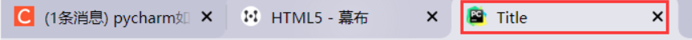
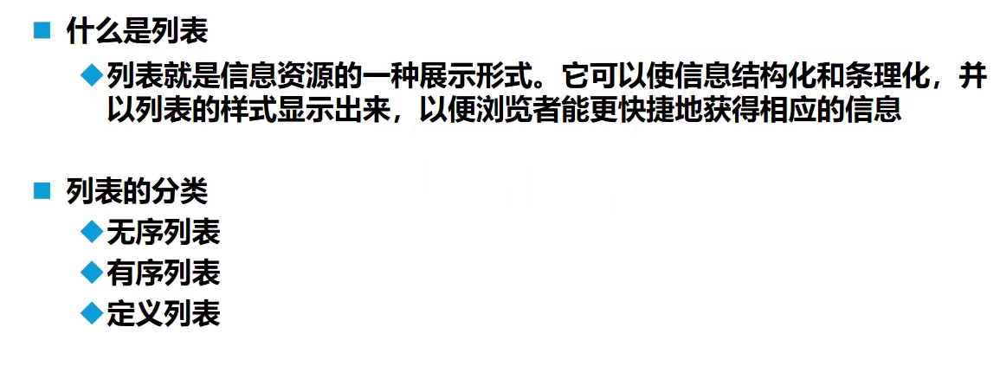

# 一、初识HTML5

- ==HTML5：Hyper Text Markup Language（超文本标记语言）==
- ==html注释：< !–注释内容–>==
- ==< body >、< /body>等成对的标签，分别叫做开放标签和闭合标签==
- ==单独呈现的标签（空元素），如< hr/ >，意为用/来关闭空元素==
- ==`<tittle>Tittle</tittle>`：网页题目==

- ==使用IDEA等Jetbrains公司IDE，可以输入关键字然后按住 Tab 补齐==

# 二、基本标签

##2.1、标题标签：`<hn></hn>` ，一共6级

```html
<h1>一级标题</h1>
<h2>二级标题</h2>
```


## 2.2、段落标签：`<p></p>`

```html
<p>第一段</p>
<p>第二段</p>
```


##2.3、换行标签：`<br/>`

```html
<!--换行标签-->
使用前：这是第一段
这是第二段
<hr/>
使用后：这是第一段<br/>
这是第二段
```


## 2.4、制作水平线标签：`<hr/>`

```html
<!--水平线1-->
<hr/>
制作水平线
<br/>
```


## 2.5、字体加粗标签：`<stronger></stronger>`

```html
<!--字体加粗-->
字体<strong>加粗</strong>
```


## 2.6、字体倾斜标签：`<em></em>`

```html
<!--字体倾斜-->
字体<em>倾斜</em>
```


##2.7、特殊符号：`&`

==利用`&` + 对应的特殊符号可以输出特殊符号，末尾要加分号==

```html
<!--特殊符号-->
1、空格：文&nbsp;&nbsp;&nbsp;&nbsp;&nbsp;&nbsp;&nbsp;&nbsp;字 <br/>
<!--对于不用nbsp，直接输入空格的，无论输入多少个空格，都只空一个-->
2、大于号：&gt;<br/>
3、小于号：&lt;<br/>
4、版权符号:&copy;
```


# 三、图像标签


```html
<!DOCTYPE html>
<html lang="en">
<head>
    <meta charset="UTF-8">
    <title>图片标签</title>
</head>
<body>
<!--图像标签
src：图片位置，可以使用相对位置和绝对位置
    "../" 代表上级目录
alt：图片位置找不到时显示的文字
tittle：悬停文字
width：图片宽度
height：图像高度
-->

</body>
</html>
```


# 四、链接标签


```html
<!DOCTYPE html>
<html lang="en">
<head>
    <meta charset="UTF-8">
    <title>链接标签</title>
</head>
<body>
<!--a 标签
href：必填，表示要跳转的界面
target：链接窗口打开位置
    "_blank"：在新窗口打开
    "_self"：在此窗口打开链接
-->

<!--制作顶部锚-->
<a name="Top">顶部</a>

<h1>
    <p>
        <a href="https://www.baidu.com" target="_blank">跳转到百度</a><br/>
    </p>
</h1>

<a href="Class02_ImageLabel.html" target="_self">跳转到图像标签代码</a><br/>
<hr/>

<!--也可以将图像作为连接-->
<a href="Class02_ImageLabel.html">
    
</a>
<hr/>

<a href="Class02_ImageLabel.html">
    
</a>

<!--锚链接
    1、需要一个标记锚
    2、跳转到标记
    3、使用#标记
-->
<a href="#Top">
    跳转到顶部
</a>
</body>
</html>
```

# 五、块元素和行内元素


# 六、列表标签



```html
<hr/>
<strong>无序列表</strong>
<hr>
<!--无序列表
应用范围：导航、侧边栏-->
<ul>编程语言
    <li>Python</li>
    <li>Java</li>
    <li>Go</li>
    <li>Rust</li>
    <li>C</li>
</ul>

<hr/>
<strong>自定义列表</strong>
<hr>
<!--自定义列表
    dl：标签，说明是自定义列表
    dt：列表名称
    dd：列表内容
-->
<dl>
    <dt>编程语言</dt>
    <dd>Java</dd>
    <dd>C</dd>
    <dd>Python</dd>
    <dd>Go</dd>
    <hr/>
    <dt>城市</dt>
    <dd>徐州</dd>
    <dd>兰州</dd>
    <dd>济南</dd>
</dl>
</body>
</html>
```


# 七、表格标签

```html
<!DOCTYPE html>
<html lang="en">
<head>
    <meta charset="UTF-8">
    <title>表格标签</title>
</head>
<body>
<!--表格 table
    行：tr
    列；td
-->
</body>
<!--表格一：原始表格-->
<hr>
<strong>表格一：原始表格</strong>
<hr>
<table border="1px">
    <tr>
        <td>1-1</td>
        <td>1-2</td>
        <td>1-3</td>
    </tr>
    <tr>
        <td>2-1</td>
        <td>2-2</td>
        <td>2-3</td>
    </tr>
      <tr>
        <td>3-1</td>
        <td>3-2</td>
        <td>3-3</td>
    </tr>
</table>
<!--表格二：跨列-->
<hr>
<strong>表格二：跨列</strong>
<hr>
<table border="1px">
    <tr>
        <!--  align="center"  -> 左右居中
              valign="center" -> 上下居中
              colspan：所跨列数-->
        <td colspan="3" align="center" valign="center">1-1</td>
    </tr>
    <tr>
        <td>2-1</td>
        <td>2-2</td>
        <td>2-3</td>
    </tr>
      <tr>
        <td>3-1</td>
        <td>3-2</td>
        <td>3-3</td>
    </tr>
</table>
<!--表格三：跨行-->
<hr>
<strong>表格三：跨行</strong>
<hr>
<table border="1px">
    <tr>
        <!--rowspan：所跨行数-->
        <td rowspan="3">1-1</td>
        <td>1-2</td>
        <td>1-3</td>
    </tr>
    <tr>
        <td>2-1</td>
        <td>2-2</td>
    </tr>
      <tr>
        <td>3-1</td>
        <td>3-2</td>
    </tr>
</table>
</html>
```


# 八、媒体元素

```html
<!DOCTYPE html>
<html lang="en">
<head>
    <meta charset="UTF-8">
    <title>媒体标签</title>
</head>
<body>
<!--视频和音频
src：视频路径
controls：控制条，如果不设置，网页上就不会显示出视频，需要右击界面
autoplay：自动播放
-->
<video src="../Resource/Moive/MV.mp4" controls autoplay></video>
<!--音频设置和视频一样-->
<audio src=""></audio>
</body>
</html>
```


# 九、页面结构分析


# 十、iframe 内联框架

```html
<!DOCTYPE html>
<html lang="en">
<head>
    <meta charset="UTF-8">
    <title>iframe标签</title>
</head>
<body>
<!--iframe标签
    src：链接地址
    width：宽度
    height：高度
-->
<!--<iframe src="https://www.baidu.com" frameborder="0"></iframe>-->
<iframe src="//player.bilibili.com/player.html?aid=55631961&bvid=BV1x4411V75C&cid=97257967&page=11" scrolling="no" border="0"
        frameborder="no" framespacing="0" allowfullscreen="true"
        width="1080" height="640">
</iframe>
</body>
</html>
```


# 十一、表单 post 和 get 提交

## 11.1、基本使用方式


**表单一般和用户输入联合使用**

```html
<!DOCTYPE html>
<html lang="en">
<head>
    <meta charset="UTF-8">
    <title>表单标签</title>
</head>
<body>
<!--form标签
    action：表单提交的位置，可以是网络，也可以是一个请求处理出地址
    methon：提交方式，主要有两种
        get:外面可以在url中看到外面提交的信息，不安全，高效
        post：比较安全，可以传输大文件；需要检查页面元素
-->
<form action="Class02_ImageLabel.html" method="get">
    <p>
    <hr>
        名称：
        <input type="text">
    </p>
    <p>
        <hr/>
        <input type="submit" value="确认提交">
        <input type="reset" value="清空">
    </p>
</form>
</body>
</html>
```


## 11.2、input 常见属性

|   属性    |                             说明                             |
| :-------: | :----------------------------------------------------------: |
|   type    | 指定元素的类型。text、password、checkbox、radio、submit、reset、file、hidden、image、button，默认text |
|   name    |                      指定表单元素的名称                      |
|   value   |          元素的初始值。type为radio时必须指定一个值           |
|   size    | 指定表单元素的初始宽度。但type为text或password时，表单元素的大小以字符为单位。对于其他类型，宽度以像素为单位。 |
| maxlength |           type为text或password时，输入的最大字符数           |
|  checked  |         type为radio或checkbox时，指定按钮是否被选中          |

## 11.3、示例一：文本框和单选按钮

```html
<!DOCTYPE html>
<html lang="en">
<head>
    <meta charset="UTF-8">
    <title>表单标签</title>
</head>
<body>
<form action="Class02_ImageLabel.html" method="get">
    <p>用户名：
        <input type="text" placeholder="请输入用户">
    </p>
    <hr/>

    <p>密码：
        <input type="password">
    </p>
    <hr>

    <p>性别：
        <!--radio代表单选框
            name：代表组
            value：单选框值
            "男"代表提示-->
        <!--如果要确保只能单选，要在同一分组，即 name 相同-->
        <input type="radio" name="sex" value="male">男
        <input type="radio" name="sex" value="female">女
    </p>
    <hr/>
    
    <p>
        <input type="submit" value="确认提交">
        <input type="reset"  value="清空内容">
    </p>
    <hr/>
</form>
</body>
</html>
```


##11.4、示例二：多选按钮

```html
    <p>爱好
        <!--多选按钮-->
        <input type="checkbox" name="hobby" value="Code">编程
        <input type="checkbox" name="hobby" value="Basketball">篮球
        <input type="checkbox" name="hobby" value="Dinner">美食
        <input type="checkbox" name="hobby" value="Sleep">睡觉
    </p>
```

## 11.5、示例三：文本域和文件域

```html
<p>
   <!--文本域-->
   <textarea name="文本区域" cols="50" rows="10">文本</textarea>
</p>
<hr/>
    
<p>
   <!--文件域-->
   <input type="file" name="files">
</p>
<hr/>
```


## 11.6、示例四：邮件、网页、数字、滑块和搜索

```html
<p>邮件：
        <input type="email">
</p>
<hr/>
    
<p>网页:
        <input type="url">
</p>
<hr/>
    
<p>年龄:
        <!--数字类型
            value：代表默认值
            max：最大值
            min：最小值
            step：按一次改变的值大小
        -->
        <input type="number" name="num" value="18" max="100" min="0" step="5">
</p>
<hr/>
    
<P>音量：
        <!--滑块模型-->
        <input type="range" value="10">
</P>
<hr/>

<p>搜索：
        <input type="search" name="Search">
</p>
<hr/>
```


## 11.7、表单的应用

- 隐藏域：hidden
- 只读：readonly
- 禁用：disabled

```html
<p>名称1：
        <!--只读：不可以填写内容    -->
        <input type="text" readonly>
</p>
<hr/>

<p>名称2：
        <input type="text" disabled>
</p>
<hr/>

<p>名称3：
        <input type="text" hidden>
</p>
<hr/>
```


## 11.8、表单的初级验证

- placeholder：提示信息
- required：非空判断
- pattern：正则表达式

```html
<p>名称：
    <!--required要求改文本框不能为空，否则不可提交-->
	<input type="text" placeholder="请输入姓名" required>
</p>
<hr/>
```


```html
<p>自定义邮箱：
	<!--pattern要求文本框按照正则表达式输入，否则不可提交-->
	<input type="text" name="diy" pattern="/^([a-z0-9_\.-]+)@([\da-z\.-]+)\.([a-z\.]{2,6})$/">
</p>
<hr/>
```


# 十二、总结

