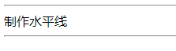

# 一、初识HTML5

- ==HTML5：Hyper Text Markup Language（超文本标记语言）==
- ==html注释：< !–注释内容–>==
- ==< body >、< /body>等成对的标签，分别叫做开放标签和闭合标签==
- ==单独呈现的标签（空元素），如< hr/ >，意为用/来关闭空元素==
- ==`<tittle>Tittle</tittle>`：网页题目==

- ==使用IDEA等Jetbrains公司IDE，可以输入关键字然后按住 Tab 补齐==

# 二、基本标签

##2.1、标题标签：`<hn></hn>` ，一共6级

```html
<h1>一级标题</h1>
<h2>二级标题</h2>
```


## 2.2、段落标签：`<p></p>`

```html
<p>第一段</p>
<p>第二段</p>
```


##2.3、换行标签：`<br/>`

```html
<!--换行标签-->
使用前：这是第一段
这是第二段
<hr/>
使用后：这是第一段<br/>
这是第二段
```


## 2.4、制作水平线标签：`<hr/>`

```html
<!--水平线1-->
<hr/>
制作水平线
<br/>
```



## 2.5、字体加粗标签：`<stronger></stronger>`

```html
<!--字体加粗-->
字体<strong>加粗</strong>
```


## 2.6、字体倾斜标签：`<em></em>`

```html
<!--字体倾斜-->
字体<em>倾斜</em>
```


##2.7、特殊符号：`&`

==利用`&` + 对应的特殊符号可以输出特殊符号，末尾要加分号==

```html
<!--特殊符号-->
1、空格：文&nbsp;&nbsp;&nbsp;&nbsp;&nbsp;&nbsp;&nbsp;&nbsp;字 <br/>
<!--对于不用nbsp，直接输入空格的，无论输入多少个空格，都只空一个-->
2、大于号：&gt;<br/>
3、小于号：&lt;<br/>
4、版权符号:&copy;
```


# 三、图像标签


```html
<!DOCTYPE html>
<html lang="en">
<head>
    <meta charset="UTF-8">
    <title>图片标签</title>
</head>
<body>
<!--图像标签
src：图片位置，可以使用相对位置和绝对位置
    "../" 代表上级目录
alt：图片位置找不到时显示的文字
tittle：悬停文字
width：图片宽度
height：图像高度
-->

</body>
</html>
```


# 四、链接标签


```html
<!DOCTYPE html>
<html lang="en">
<head>
    <meta charset="UTF-8">
    <title>链接标签</title>
</head>
<body>
<!--a 标签
href：必填，表示要跳转的界面
target：链接窗口打开位置
    "_blank"：在新窗口打开
    "_self"：在此窗口打开链接
-->

<!--制作顶部锚-->
<a name="Top">顶部</a>

<h1>
    <p>
        <a href="https://www.baidu.com" target="_blank">跳转到百度</a><br/>
    </p>
</h1>

<a href="Class02_ImageLabel.html" target="_self">跳转到图像标签代码</a><br/>
<hr/>

<!--也可以将图像作为连接-->
<a href="Class02_ImageLabel.html">
    
</a>
<hr/>

<a href="Class02_ImageLabel.html">
    
</a>

<!--锚链接
    1、需要一个标记锚
    2、跳转到标记
    3、使用#标记
-->
<a href="#Top">
    跳转到顶部
</a>
</body>
</html>
```

# 五、块元素和行内元素


# 六、列表标签


```html
<hr/>
<strong>无序列表</strong>
<hr>
<!--无序列表
应用范围：导航、侧边栏-->
<ul>编程语言
    <li>Python</li>
    <li>Java</li>
    <li>Go</li>
    <li>Rust</li>
    <li>C</li>
</ul>

<hr/>
<strong>自定义列表</strong>
<hr>
<!--自定义列表
    dl：标签，说明是自定义列表
    dt：列表名称
    dd：列表内容
-->
<dl>
    <dt>编程语言</dt>
    <dd>Java</dd>
    <dd>C</dd>
    <dd>Python</dd>
    <dd>Go</dd>
    <hr/>
    <dt>城市</dt>
    <dd>徐州</dd>
    <dd>兰州</dd>
    <dd>济南</dd>
</dl>
</body>
</html>
```


# 七、表格标签

```html
<!DOCTYPE html>
<html lang="en">
<head>
    <meta charset="UTF-8">
    <title>表格标签</title>
</head>
<body>
<!--表格 table
    行：tr
    列；td
-->
</body>
<!--表格一：原始表格-->
<hr>
<strong>表格一：原始表格</strong>
<hr>
<table border="1px">
    <tr>
        <td>1-1</td>
        <td>1-2</td>
        <td>1-3</td>
    </tr>
    <tr>
        <td>2-1</td>
        <td>2-2</td>
        <td>2-3</td>
    </tr>
      <tr>
        <td>3-1</td>
        <td>3-2</td>
        <td>3-3</td>
    </tr>
</table>
<!--表格二：跨列-->
<hr>
<strong>表格二：跨列</strong>
<hr>
<table border="1px">
    <tr>
        <!--  align="center"  -> 左右居中
              valign="center" -> 上下居中
              colspan：所跨列数-->
        <td colspan="3" align="center" valign="center">1-1</td>
    </tr>
    <tr>
        <td>2-1</td>
        <td>2-2</td>
        <td>2-3</td>
    </tr>
      <tr>
        <td>3-1</td>
        <td>3-2</td>
        <td>3-3</td>
    </tr>
</table>
<!--表格三：跨行-->
<hr>
<strong>表格三：跨行</strong>
<hr>
<table border="1px">
    <tr>
        <!--rowspan：所跨行数-->
        <td rowspan="3">1-1</td>
        <td>1-2</td>
        <td>1-3</td>
    </tr>
    <tr>
        <td>2-1</td>
        <td>2-2</td>
    </tr>
      <tr>
        <td>3-1</td>
        <td>3-2</td>
    </tr>
</table>
</html>
```


# 八、媒体元素

```html
<!DOCTYPE html>
<html lang="en">
<head>
    <meta charset="UTF-8">
    <title>媒体标签</title>
</head>
<body>
<!--视频和音频
src：视频路径
controls：控制条，如果不设置，网页上就不会显示出视频，需要右击界面
autoplay：自动播放
-->
<video src="../Resource/Moive/MV.mp4" controls autoplay></video>
<!--音频设置和视频一样-->
<audio src=""></audio>
</body>
</html>
```


# 九、页面结构分析

